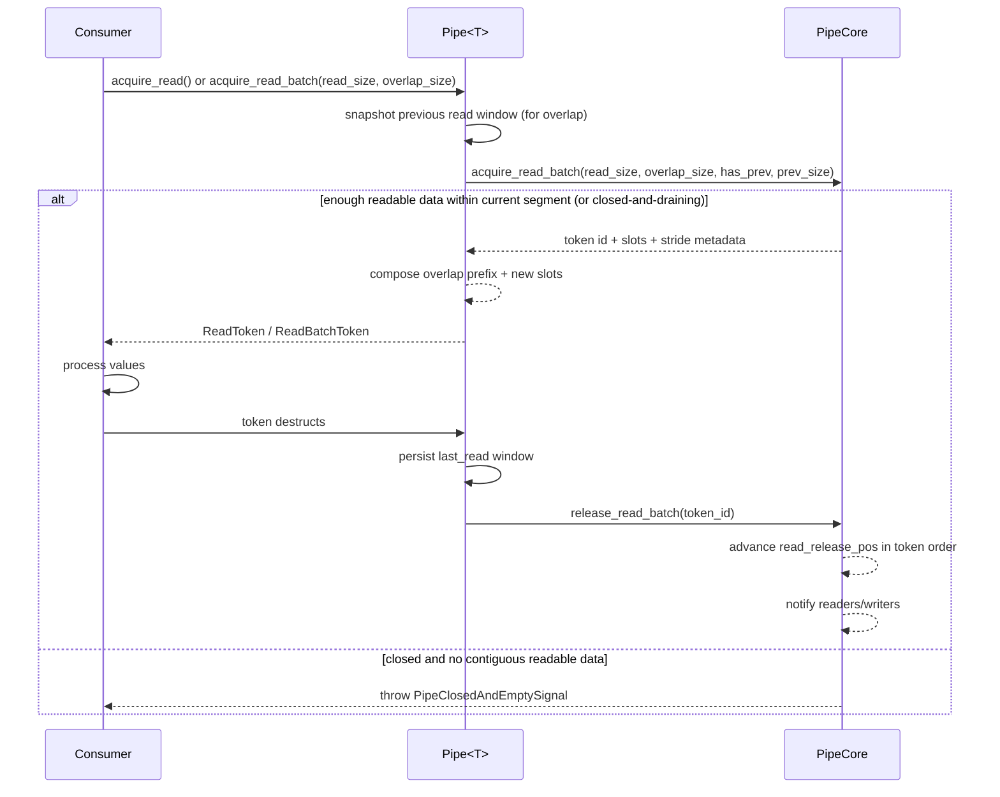

# Pipe Read Path Sequence

This page describes the read-side sequence, including overlap-window behavior.

## Sequence Diagram

## Overlap Rules

- `overlap_size` must be smaller than `read_size`.
- Overlap read requires one previous completed read batch.
- Overlap prefix is sourced from the previous read window snapshot.
- Overlap is constrained to the same segment and never crosses a segment boundary.

## Segment Rules

- Read batches are clipped to the nearest committed segment end.
- `ReadToken`/`ReadBatchToken` expose `is_segment_start()` and `is_segment_end()`.
- Consumers can use segment flags to trigger end-of-shot flushing logic.

## Notes

- Read visibility is controlled by contiguous committed write order, not by isolated later publishes.
- Slot release occurs when read token lifetime ends, and free capacity is returned in read-token release order.
- If the pipe faulted because of an earlier unpublished write token, readers can only drain the already visible prefix, then receive `PipeClosedAndEmptySignal`.
- Core remains type-agnostic; overlap value composition is handled by Pipe<T>.
