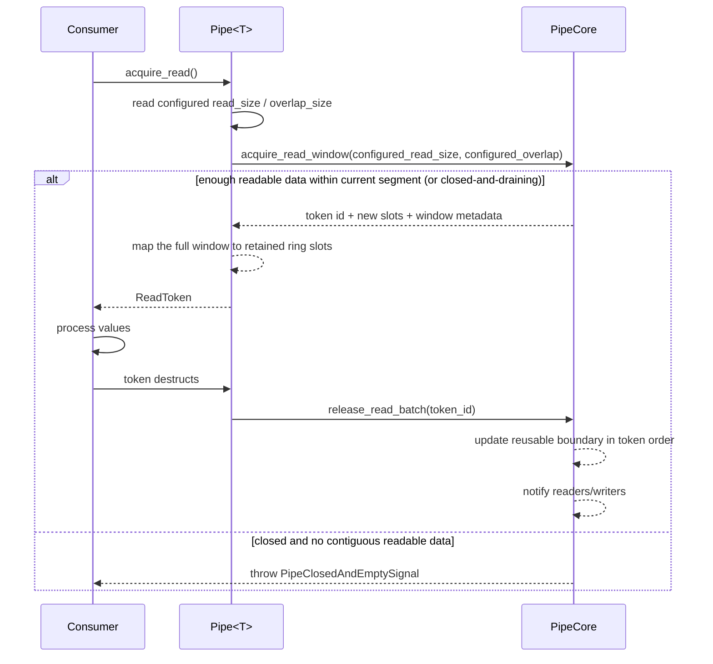

# Pipe Read Path Sequence

This page describes the read-side sequence, including overlap-window behavior.

## Sequence Diagram

```mermaid
sequenceDiagram
    participant Consumer
    participant Pipe as Pipe<T>
    participant Core as PipeCore

    Consumer->>Pipe: acquire_read()
    Pipe->>Pipe: read configured read_size / overlap_size
    Pipe->>Core: acquire_read_window(configured_read_size, configured_overlap)

    alt enough readable data within current segment (or closed-and-draining)
        Core-->>Pipe: token id + new slots + window metadata
        Pipe-->>Pipe: map the full window to retained ring slots
        Pipe-->>Consumer: ReadToken
        Consumer->>Consumer: process values
        Consumer->>Pipe: token destructs
        Pipe->>Core: release_read_batch(token_id)
        Core-->>Core: update reusable boundary in token order
        Core-->>Core: notify readers/writers
    else closed and no contiguous readable data
        Core-->>Consumer: throw PipeClosedAndEmptySignal
    end
```

## Overlap Rules

- `overlap_size` must be smaller than `read_size`.
- `acquire_read()` always uses the configured consumer window.
- The overlap prefix refers to slots in the previous window that remain in the
  ring buffer; no payload snapshot is made.
- Read acquisition reserves successive windows in order. Active tokens pin
  their slots until release, even if processing completes out of order.
- Overlap is constrained to the same segment and never crosses a segment boundary.

## Segment Rules

- Read windows are clipped to the nearest committed segment end.
- `ReadToken` exposes `size()`, `overlap_size()`, `is_segment_start()`, and
  `is_segment_end()`.
- Consumers can use segment flags to trigger end-of-shot flushing logic.

## Notes

- Read visibility is controlled by contiguous committed write order, not by isolated later publishes.
- Active-window slots remain pinned until token destruction, and the trailing
  configured overlap remains pinned for the next acquisition.
- If the pipe faulted because of an earlier unpublished write token, readers can only drain the already visible prefix, then receive `PipeClosedAndEmptySignal`.
- Core remains type-agnostic; `Pipe<T>` maps each window position directly to
  its ring-buffer slot.
