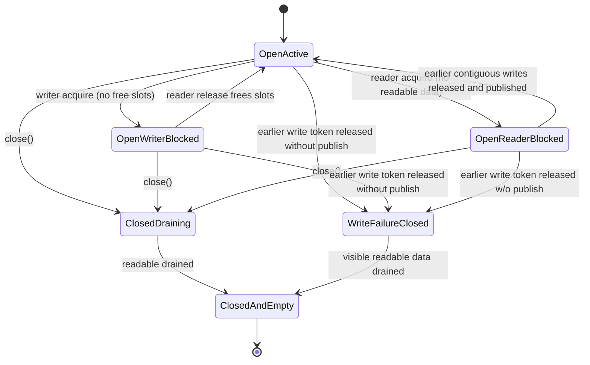

# PipeCore State Machine

This page describes the runtime state transitions of the non-template scheduler core used by Pipe.

## Core State Variables

- write_visible_pos: contiguous readable boundary reached by committed writes
- write_reserve_pos: logical end of reserved write region
- read_reserve_pos: logical end of reserved read region
- read_release_pos: logical end of fully released read region
- closed: whether the pipe is closed for new write acquisition

## Effective Runtime States

1. Open-Active
- closed is false
- producers can acquire write batches if free slots exist
- consumers can acquire read batches if readable data exists

2. Open-WriterBlocked
- closed is false
- producers are waiting because free slots are insufficient
- transition out when readers release consumed slots in order

3. Open-ReaderBlocked
- closed is false
- consumers are waiting because readable data is insufficient
- transition out when contiguous earlier write tokens are released and published

4. Closed-Draining
- closed is true
- no new write acquisition is allowed
- consumers continue draining readable data

5. Closed-And-Empty
- closed is true and readable data is exhausted
- acquire_read path throws PipeClosedAndEmptySignal

6. Write-Failure-Closed
- an earlier write token was released without publish
- later writes are not allowed to bypass the failed gap
- pipe transitions to closed terminal behavior
- future write acquisitions throw `PipeFaultedError`

## Transition Diagram

## Important Invariants

1. readers only observe a contiguous committed prefix of writes
2. later published writes never bypass earlier unresolved writes
3. when an earlier write token is destroyed without publish, the pipe enters a terminal failure-close path
4. read capacity is returned only when read tokens are released in order
5. close only prevents future write acquisition; it does not discard already visible readable data
6. the fault reason is retained as sticky metadata for diagnostics

## Mapping To Public API

- Pipe acquire_write and acquire_write_batch reserve capacity through PipeCore
- Pipe publish marks reserved writes as committed; visibility advances only through contiguous release order
- Pipe acquire_read and acquire_read_batch consume readable data through PipeCore
- Pipe close forwards directly to PipeCore close
