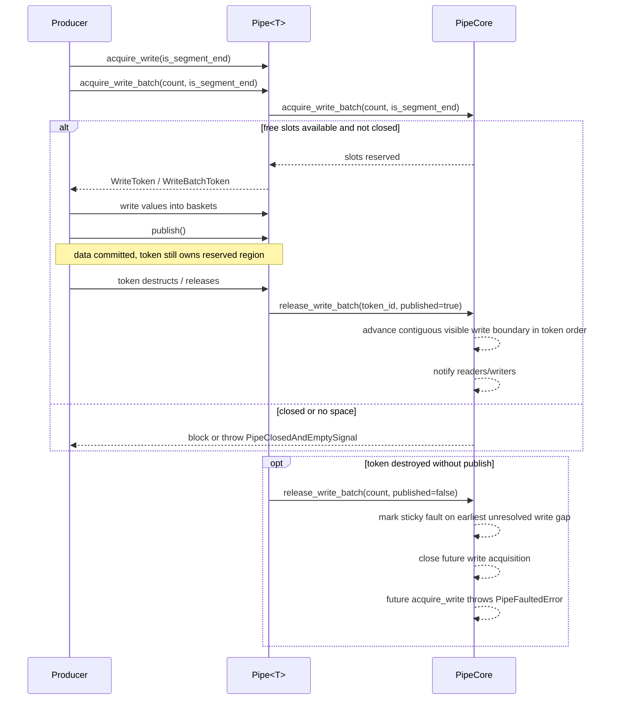

# Pipe Write Path Sequence

This page describes the write-side sequence from producer code to PipeCore state updates.

## Sequence Diagram

## Notes

- Capacity reservation happens before producer writes element payload.
- Each write token carries segment metadata: `is_segment_start` and `is_segment_end`.
- Segment boundaries are committed in write-token order with the same visibility rules as payload data.
- `publish()` does not by itself make data visible to readers.
- Visibility advances when a published write token is released, and only if all earlier write tokens have already been released and published.
- A published token that remains alive still occupies capacity and can stall downstream visibility.
- Destroying a write token without publish triggers sticky pipe fault semantics.
- Backpressure is enforced by Core through available-slot checks.
